# X-O Real-time Game - Laravel WebSocket Implementation

<p align="center">
<a href="https://laravel.com" target="_blank">
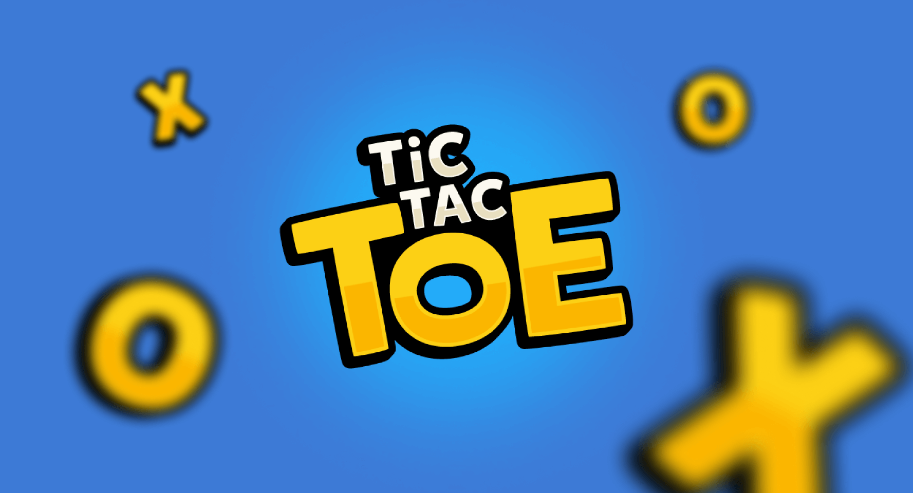
</a>
</p>

## Overview

A real-time multiplayer Tic-Tac-Toe (X-O) game built with Laravel 12 and WebSocket technology using Reverb server. This application allows players to create rooms, invite others, and play the classic game with instant updates through WebSocket connections.

## Features

-   Real-time multiplayer gameplay using WebSockets
-   Room-based system with unique codes
-   Player vs player matches with symbol selection
-   Spectator mode for observing ongoing games
-   Score tracking and player rankings
-   Responsive design with Tailwind CSS
-   Automatic game state management
-   Arabic language support with RTL layout

## Screenshots

<div align="center">

<table>
  <tr>
    <td>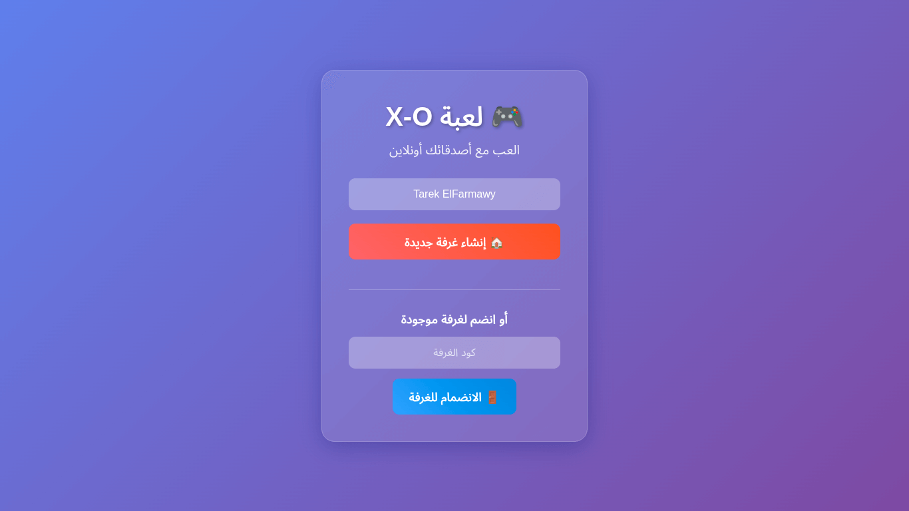</td>
    <td>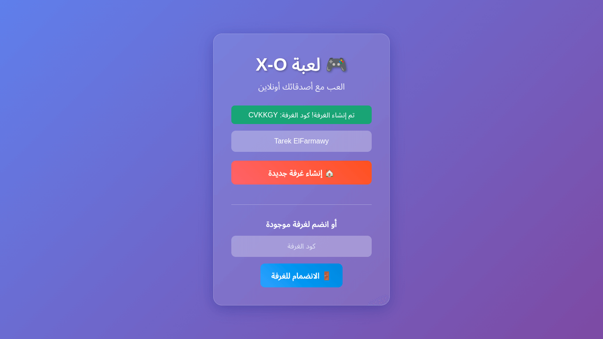</td>
    <td>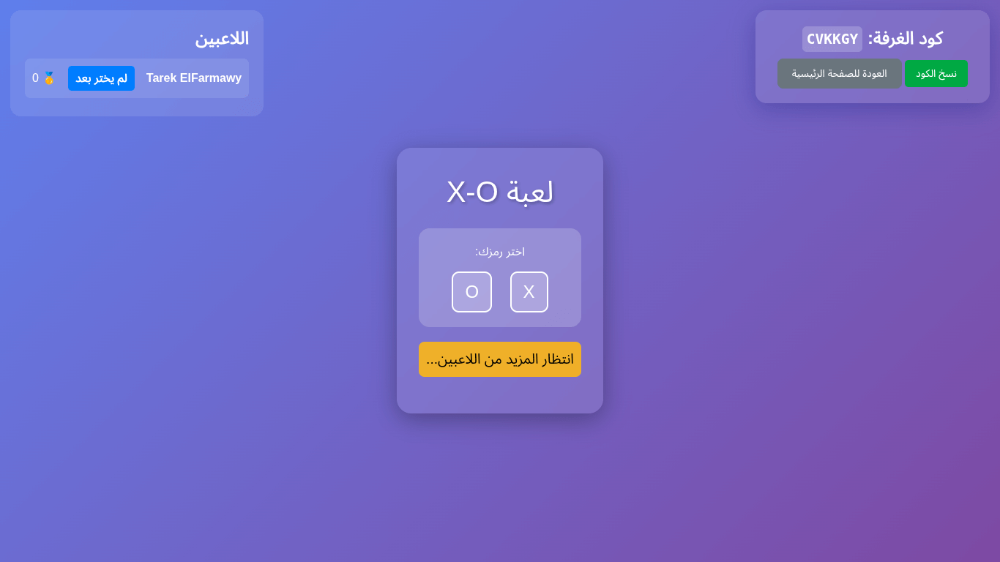</td>
  </tr>
  <tr>
    <td>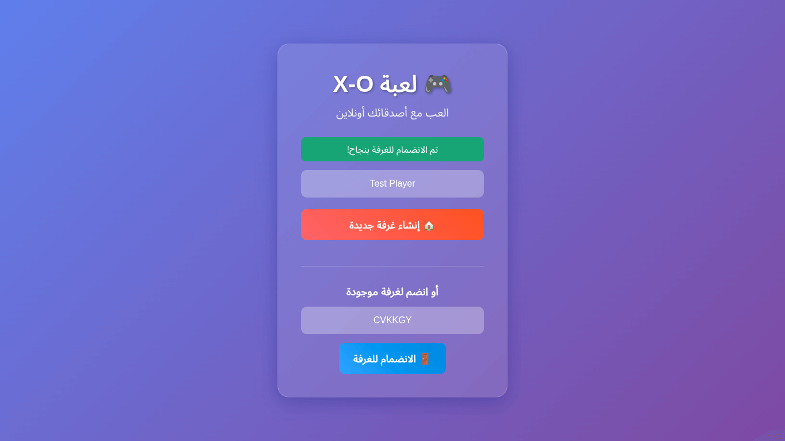</td>
    <td>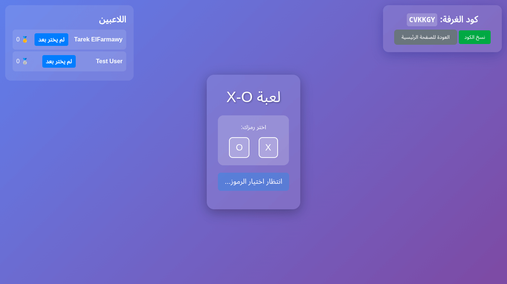</td>
    <td>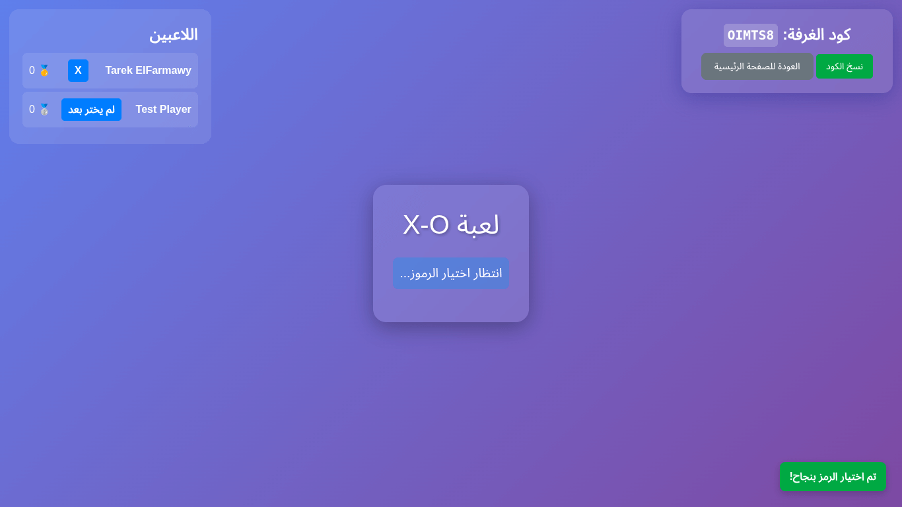</td>
  </tr>
  <tr>
    <td>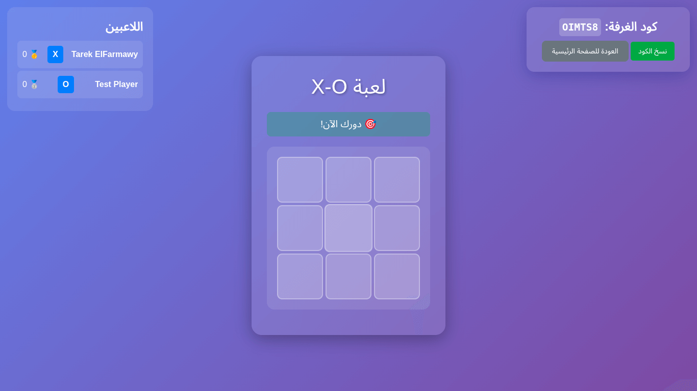</td>
    <td>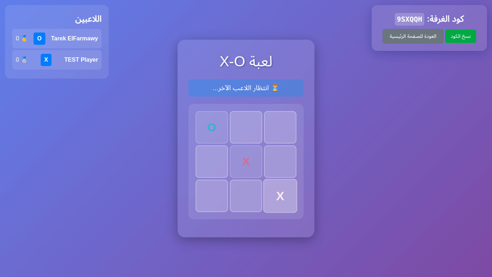</td>
    <td>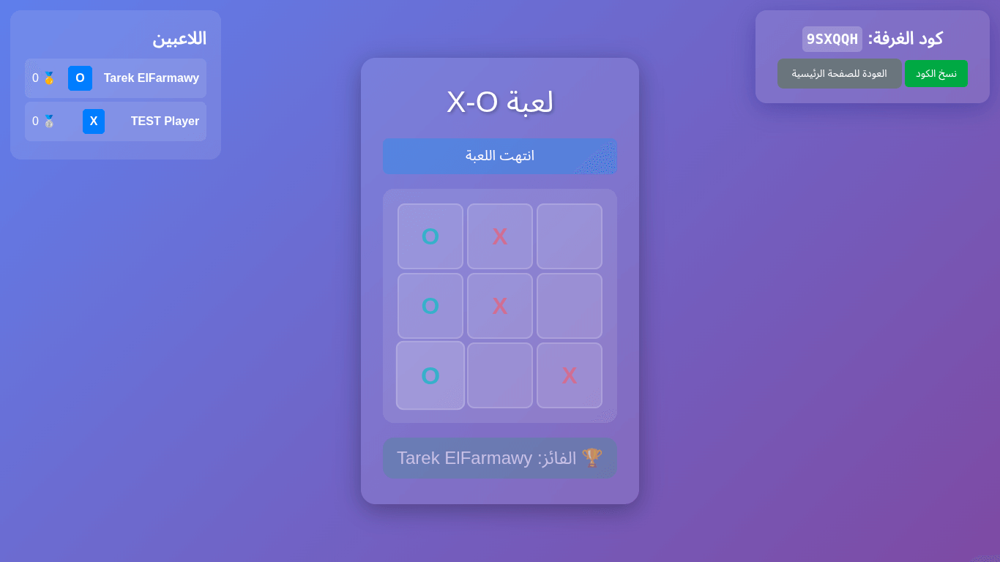</td>
  </tr>
  <tr>
    <td>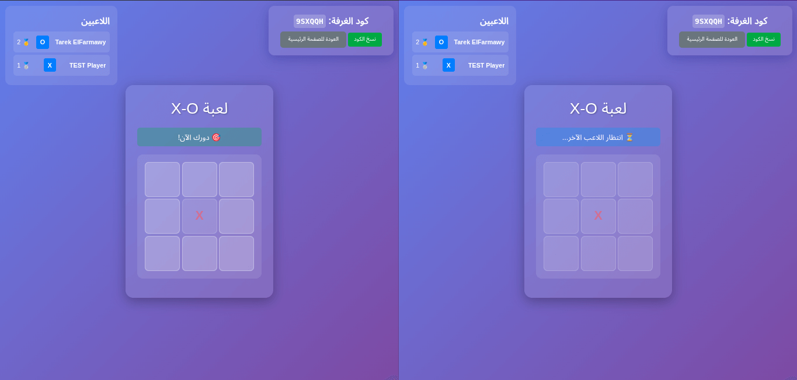</td>
    <td>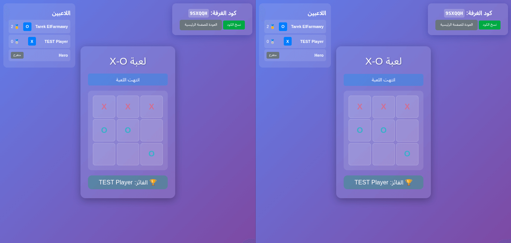</td>
    <td>
        <video width="250" autoplay>
            <source src="./public/screenshots/X_O.mp4" type="video/mp4">
        </video>
    </td>
  </tr>
</table>

</div>

## Technology Stack

-   **Backend**: Laravel 12, PHP 8.1+
-   **WebSocket**: Laravel Reverb
-   **Frontend**: Blade templates, JavaScript, Tailwind CSS
-   **Caching**: Redis or file-based (configurable)
-   **Build Tool**: Vite

## Installation Guide

### Prerequisites

-   PHP 8.1 or higher
-   Composer
-   Node.js and npm
-   Redis (recommended) or alternative cache driver
-   WebSocket compatible server environment

### Step-by-Step Installation

1. **Clone the repository**

    ```bash
    git clone https://github.com/TarekHesham/laravel-realtime-game
    cd xo-game
    ```

2. **Install PHP dependencies**

    ```bash
    composer install
    ```

3. **Install JavaScript dependencies**

    ```bash
    npm install
    ```

4. **Environment configuration**

    ```bash
    cp .env.example .env
    php artisan key:generate
    ```

5. **Configure environment variables**
   Edit `.env` file with your database and cache settings:

    ```env
    APP_NAME=XO-Game
    APP_ENV=local
    APP_KEY=base64:...
    APP_DEBUG=true
    APP_URL=http://localhost:8000

    DB_CONNECTION=mysql
    DB_HOST=127.0.0.1
    DB_PORT=3306
    DB_DATABASE=xo_game
    DB_USERNAME=root
    DB_PASSWORD=

    BROADCAST_CONNECTION=reverb
    REVERB_APP_ID=your_app_id
    REVERB_APP_KEY=your_app_key
    REVERB_APP_SECRET=your_app_secret
    REVERB_HOST="0.0.0.0"
    REVERB_PORT=8080
    REVERB_SCHEME=https

    CACHE_DRIVER=file
    SESSION_DRIVER=database
    QUEUE_CONNECTION=sync
    ```

6. **Database setup**

    ```bash
    php artisan migrate
    ```

7. **Build frontend assets**

    ```bash
    npm run build
    ```

8. **Start the vite server**

    ```bash
    npm run dev
    ```

9. **Start the WebSocket server**

    ```bash
    php artisan reverb:start
    ```

10. **Start the development server**
    ```bash
    php artisan serve
    ```

## Usage

1. Access the application at `http://localhost:8000`
2. Enter your name and either create a new room or join an existing one using a room code
3. If joining as the second player, select your symbol (X or O)
4. Take turns making moves on the 3x3 grid
5. The game automatically detects wins and draws
6. After a game completes, players can reset to play again

## Code Structure Analysis

### Key Components

1. **GameService (App\Services\GameService)**

    - Handles core game logic and state management
    - Manages board state, turns, and win conditions
    - Uses caching for game state persistence

2. **GameController (App\Http\Controllers\GameController)**

    - API endpoints for game operations:
        - Room creation and joining
        - Move validation and processing
        - Symbol selection
        - Game state retrieval

3. **Models**

    - Room: Represents game rooms with code, board state, and status
    - RoomPlayer: Tracks players in each room with scores and symbols

4. **Events**

    - GameMove: Broadcasts moves to all players
    - GameWin: Announces game results
    - GameReset: Handles game restarts
    - GameState: Updates overall game state

5. **Frontend Components**
    - Home page: Room creation/joining interface
    - Game page: Real-time game board with player list and controls
    - JavaScript handlers for WebSocket communication

### Real-time Communication Flow

1. Client connects to WebSocket channel for specific room
2. Players make moves via AJAX to Laravel backend
3. Backend validates moves and updates game state
4. Events are broadcast to all connected clients
5. JavaScript listeners update UI in real-time

## API Endpoints

-   `POST - /api/game/create-room` - Create a new game room
-   `POST - /api/game/join-room/{roomCode}` - Join an existing room
-   `GET  - /api/game/room/{roomCode}` - Get current game state
-   `POST - /api/game/room/{roomCode}/symbol` - Select player symbol
-   `POST - /api/game/room/{roomCode}/move` - Make a move
-   `POST - /api/game/room/{roomCode}/reset` - Reset the game

## Customization

### Styling

Modify the Tailwind CSS classes in Blade templates or update the CSS in `<style>` tags for custom appearance.

### Game Rules

Adjust win conditions and board size by modifying the `GameService` methods like `checkWinner()` and `isDraw()`.

### Timeouts

Player inactivity timeouts can be configured by changing the timeout values in the `RoomPlayer` model and related checks.

## Troubleshooting

### Common Issues

1. **WebSocket connection failures**

    - Ensure Reverb server is running
    - Check firewall settings for port 8080

2. **Real-time updates not working**

    - Verify Redis server is running if using Redis driver
    - Check browser console for JavaScript errors

3. **Game state not persisting**
    - Confirm cache driver is properly configured
    - Check storage permissions

### Debug Mode

Enable debug mode in `.env` by setting `APP_DEBUG=true` to get detailed error information.

## Production Deployment

1. Set `APP_DEBUG=false` in production
2. Use `php artisan config:cache` and `php artisan route:cache`
3. Set up process manager for Reverb server (Supervisor recommended)
4. Configure SSL for secure WebSocket connections (wss://)
5. Use Redis for production caching and sessions

## Contributing

1. Fork the repository
2. Create a feature branch
3. Make changes and test thoroughly
4. Submit a pull request with description of changes

## License

This project is proprietary software. All rights reserved.
